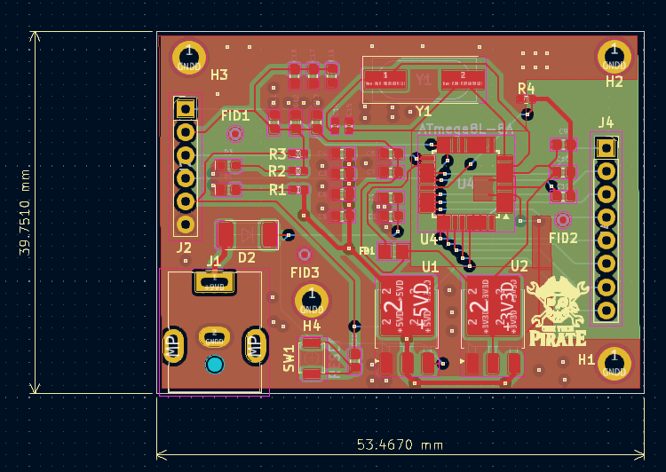
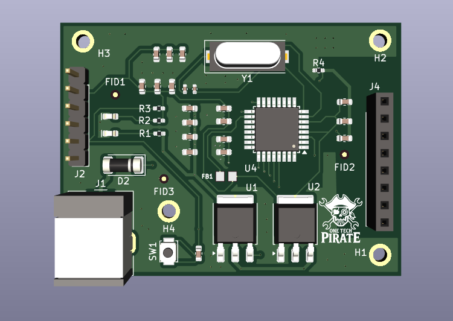

# ATmega328P Mixed-Signal Design  
*A KiCad PCB project for [Mastering KiCAD: Open source PCB design for beginners] on Coursera.*  

  

---
## 📷 Preview  
### PCB Layout  
  

### 3D View  
  

---

## 📌 Key Features  
- ATmega328P with ADC signal conditioning.  
- Proper decoupling (100nF on ARef, AVCC).  
- Optimized mixed-signal layout.  

---

## 🛠️ Repository Structure  

├── 📂 Mixed_Signal_Design/  
│   ├── 📄 Mixed_Signal_Design.kicad_pro    
│   ├── 📄 Mixed_Signal_Design.kicad_pcb    
│   ├── 📄 Mixed_Signal_Design.kicad_sch    
│   ├── 📂 schematics/
│   │   └── 📄 Mixed_Signal_Design.pdf      
│   └── 📂 fabrication_output/      
│       ├── 📂 BOM/
│       │   └── 📄 Mixed_Signal_Design.csv 
│       └── 📂 gerber/              
│                 
├── 📂 images/                      
│   ├── 📄 3d_view.png              
│   └── 📄 pcb_layout.png       
└── 📄 README.md  
